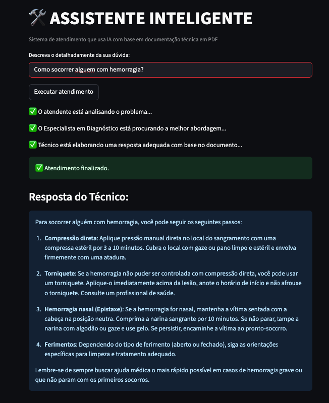

# 🛠️ Assistente Inteligente - Sistema de Suporte com IA

Um sistema de atendimento inteligente que utiliza IA para responder questões baseadas em documentação técnica em formato PDF. O sistema processa documentos PDF, cria uma base de conhecimento vetorial e responde perguntas utilizando a API da OpenAI.

## 🚀 Funcionalidades

- **Processamento de PDF**: Carrega e processa documentos PDF automaticamente
- **Base de Conhecimento**: Cria uma base vetorial usando FAISS para busca eficiente
- **IA Conversacional**: Utiliza ChatGPT para gerar respostas contextualizadas
- **Interface Amigável**: Interface web construída com Streamlit
- **Simulação de Atendimento**: Simula um fluxo de atendimento com múltiplas etapas
- **Respostas Contextualizadas**: Respostas baseadas no conteúdo específico do documento

## 🖥️ Interface



## 🛠️ Tecnologias Utilizadas

- **Python 3.12+**
- **Streamlit** - Interface web
- **LangChain** - Framework para aplicações com LLM
- **OpenAI API** - Modelo de linguagem GPT (gpt-4o-mini)
- **FAISS** - Busca vetorial eficiente
- **PyPDF** - Processamento de documentos PDF
- **python-dotenv** - Gerenciamento de variáveis de ambiente
- **NumPy & Pandas** - Processamento de dados

## 📋 Pré-requisitos

- Python 3.12 ou superior
- Chave da API OpenAI
- Documento PDF para servir como base de conhecimento

## 🔧 Instalação

1. **Clone o repositório**
   ```bash
   git clone https://github.com/seu-usuario/assistente-ia-pdf.git
   cd assistente-ia-pdf
   ```

2. **Crie um ambiente virtual**
   ```bash
   python -m venv venv
   source venv/bin/activate  # No Windows: venv\Scripts\activate
   ```

3. **Instale as dependências**
   ```bash
   pip install --upgrade pip setuptools wheel
   pip install -r requirements.txt
   ```

4. **Configure as variáveis de ambiente**
   
   Crie um arquivo `.env` na raiz do projeto:
   ```env
   OPENAI_API_KEY=sua_chave_da_api_openai_aqui
   ```

5. **Adicione seu documento PDF**
   
   Coloque seu documento PDF na raiz do projeto com o nome `document.pdf`

## 🚀 Como Usar

1. **Execute a aplicação**
   ```bash
   streamlit run app.py
   ```

2. **Acesse a interface**
   
   A aplicação será aberta automaticamente no seu navegador em `http://localhost:8501`

3. **Faça sua pergunta**
   
   Digite sua dúvida no campo de texto e clique em "Executar atendimento" ou pressione Enter

4. **Aguarde o processamento**
   
   O sistema simulará um atendimento com múltiplas etapas e retornará uma resposta baseada no documento PDF

## 📁 Estrutura do Projeto

```
assistente-ia-pdf/
├── app.py              # Aplicação principal
├── document.pdf        # Documento PDF base (adicione o seu)
├── preview.png         # Captura de tela da interface
├── .env               # Variáveis de ambiente (não commitado)
├── .gitignore         # Arquivos a serem ignorados pelo Git
├── README.md          # Este arquivo
├── requirements.txt   # Dependências do projeto
├── LICENSE            # Licença MIT
└── run.sh             # Script de execução rápida
```

## 🔧 Configuração Avançada

### Personalizando o Modelo

Para alterar o modelo da OpenAI ou ajustar parâmetros:

```python
# No arquivo app.py, linha ~74
llm=ChatOpenAI(
    temperature=0,  # Ajuste a criatividade (0-1)
    model_name="gpt-4o-mini",  # ou "gpt-4o", "gpt-3.5-turbo"
    openai_api_key=openai_api_key
)
```

### Alterando o Documento Base

1. Substitua o arquivo `document.pdf` pelo seu documento
2. Reinicie a aplicação para reprocessar o novo documento

## 🎯 Casos de Uso

- **Suporte Técnico**: Atendimento baseado em manuais técnicos
- **FAQ Inteligente**: Respostas automáticas baseadas em documentação
- **Treinamento**: Sistema de consulta para materiais de treinamento
- **Compliance**: Consultas sobre políticas e procedimentos empresariais

## 🔒 Segurança

- As chaves da API são carregadas via variáveis de ambiente
- O arquivo `.env` não deve ser commitado no repositório
- Use `.gitignore` para proteger informações sensíveis

## 🐛 Solução de Problemas

### Erro: "Defina a variável de ambiente OPENAI_API_KEY"
- Verifique se o arquivo `.env` existe e contém a chave correta
- Certifique-se de que a chave da API está válida

### Erro: "Não foi possível carregar o manual PDF"
- Verifique se o arquivo `document.pdf` existe na raiz do projeto
- Certifique-se de que o arquivo PDF não está corrompido

### Erro de dependências
- Execute: `pip install --upgrade pip`
- Reinstale as dependências: `pip install -r requirements.txt`

### Erro de Arquitetura no Mac M1/M2
Se você encontrar erros como "(mach-o file, but is an incompatible architecture (have 'x86_64', need 'arm64e' or 'arm64')":

1. **Remova o ambiente virtual atual**:
   ```bash
   rm -rf venv
   ```

2. **Crie um novo ambiente virtual ARM64**:
   ```bash
   python3 -m venv venv
   source venv/bin/activate
   ```

3. **Atualize as ferramentas**:
   ```bash
   pip install --upgrade pip setuptools wheel
   ```

4. **Instale as dependências**:
   ```bash
   pip install -r requirements.txt
   ```

### Script de Inicialização Rápida
Use o script `run.sh` para executar automaticamente:
```bash
./run.sh
```

## 🤝 Contribuindo

1. Faça um fork do projeto
2. Crie uma branch para sua feature (`git checkout -b feature/AmazingFeature`)
3. Commit suas mudanças (`git commit -m 'Add some AmazingFeature'`)
4. Push para a branch (`git push origin feature/AmazingFeature`)
5. Abra um Pull Request

## 📄 Licença

Este projeto está licenciado sob a licença MIT. Veja o arquivo `LICENSE` para mais detalhes.

⭐ Se este projeto te ajudou, considere dar uma estrela no repositório!
